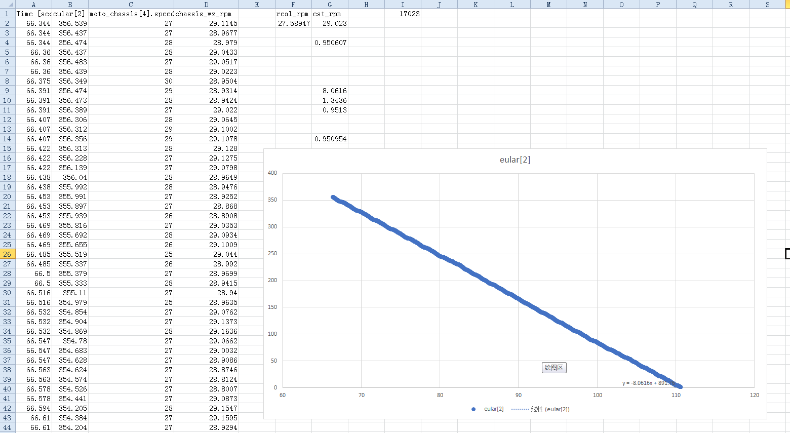

# 无IMU方案测试示例代码

----

## 开发环境

RoboMaster 开发板A型

3508电机 × 4 + C620电调 × 4（底盘电机）

6020电机 × 1（Yaw轴电机）

## 使用示例

1. 将K_XY(轮距离云台中心的水平距离与垂直距离之和)，K_CAL(参数校准值)，INIT_ANG(复位后初始化角度)填入头文件
2. 定义一个moto_ang_bundle_t类型的变量，将接收到的3508角度数据代入
3. 在初始化部分调用reset_ang_data函数，将启动时的云台绝对角度置为0
4. 定义一个moto_speed_bundle_t类型的变量，将接收到的3508转速数据代入
5. 传入上述两个参数，调用get_gimbal_angle函数获取云台绝对角度
6. 传入上述含电机转速的变量，调用get_gimbal_speed函数获取云台绝对转速

K_XY参数可不必完全精确，可以依靠后续校准修正

INIT_ANG以及角度方向的问题与电机安装有关，示例代码中电机含电源和CAN接口一侧安装在底盘，180度(4096)方向为底盘前进方向。若电机反装则需要修改代码云台电机的正负号，否则计算角度和转速会错误

四个麦克纳姆轮按照O-正方形安装，参数的第一个电机数据为右前电机（俯视，前进方向向上），逆时针方向顺序

强烈建议将原始角度和转速数据进行低通滤波后再代入计算，有助于提升后续云台控制性能

## 原理

详见RoboMaster BBS开源说明或者[此处](doc.md)

## 校准方法

1. 使Yaw轴电机无力，通过机械方式固定Yaw轴相对地面静止（只要手不抖，用手也行！）
2. 打开小陀螺或扭腰，在上位机中采集该过程中一段时间的云台电机转速，解算出的角度和转速
3. 求解算角度斜率，或者直接使用瞬时转速的平均值代表漂移角速度
4. K_CAL = 1 - 漂移角速度/底盘旋转角速度，即 K_CAL = 1 - 漂移角速度/Yaw轴电机旋转角速度（注意底盘旋转角速度和Yaw轴电机旋转角速度的方向可能不同，这里假设漂移角速度和底盘旋转角速度均为正号）

整理校准数据

## 改进方向

目前主要问题还是即使经过一次校准也达不到预期精度，希望能通过改进算法或校准方法解决

## 版权说明

License:GPL-2.0

本作品仅用于技术交流，未经作者允许，不得作任何商业用途。本作品的声明以及其修改权、保护作品完整权及最终解释权均归华南师范大学PIONEER战队所有。

